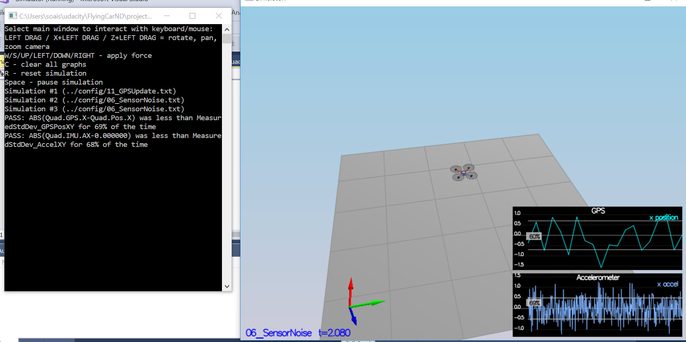
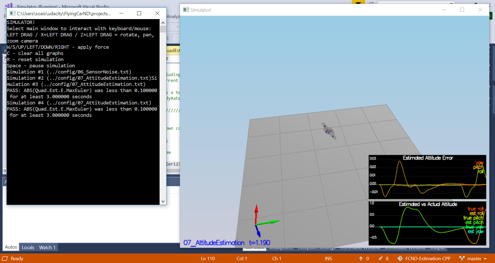
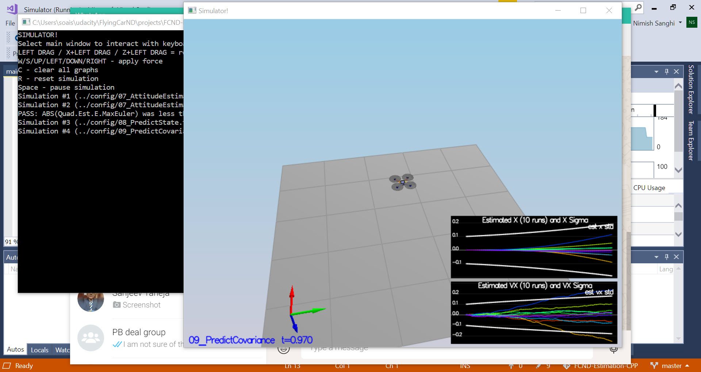
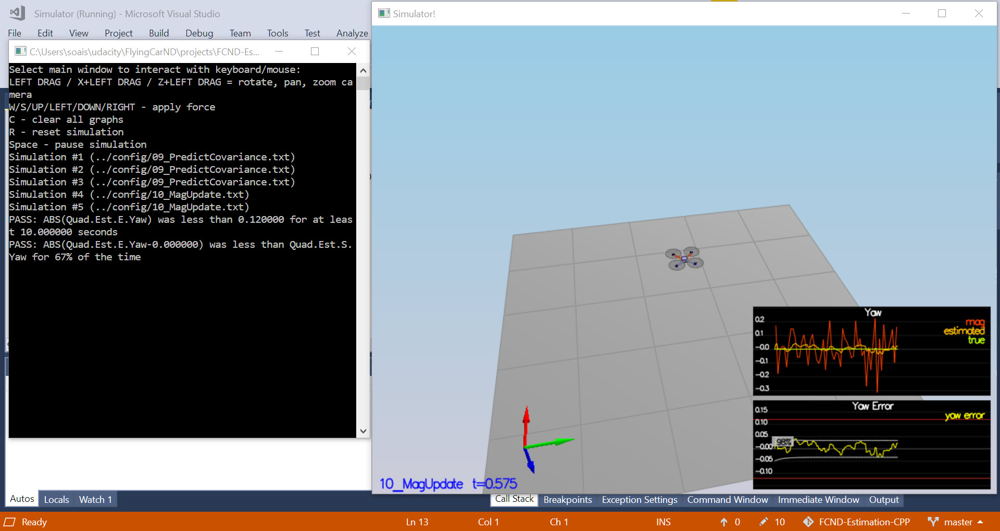
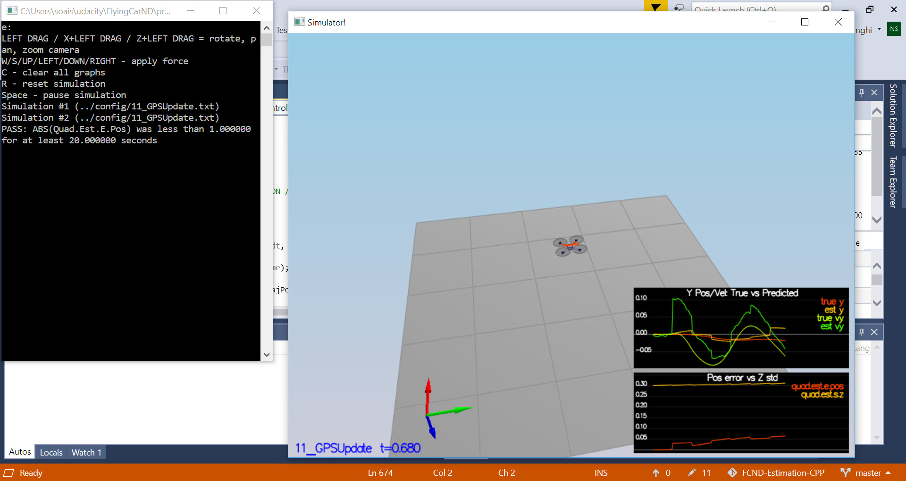
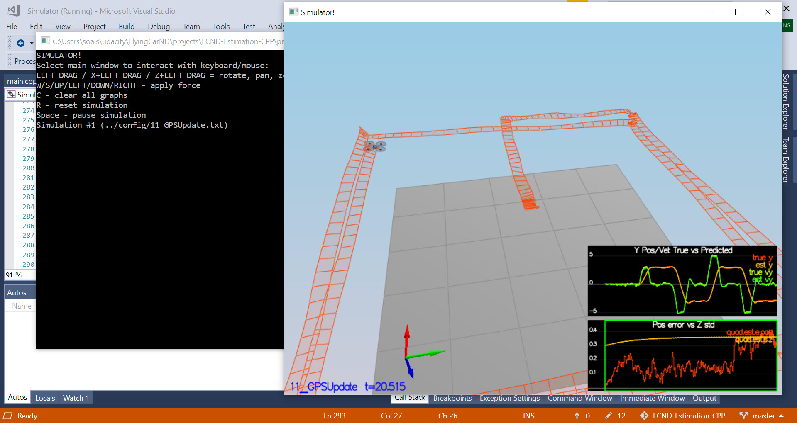
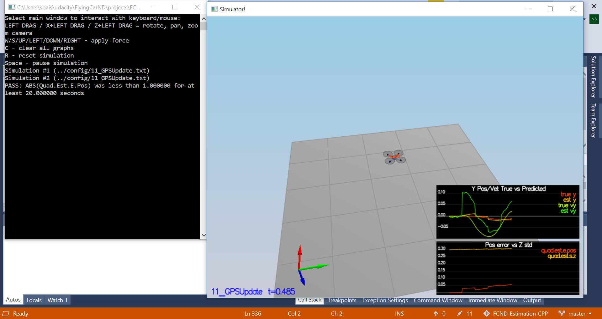

### Rubric Write-up: 3D Quad Estimation using EKF

#### Step 1. Sensor Noise
##### Determine the standard deviation of the measurement noise of both GPS X data and Accelerometer X data.

Running `06_NoisySensors` scenario produces two files in `config/log` directory. I used pandas to load and calculate the standard deviations. 

```python
import pandas as pd
df = pd.read_csv('Graph1.txt')
print(df[' Quad.GPS.X'].std())
df = pd.read_csv('Graph2.txt')
df[' Quad.IMU.AX'].std()
```

Std deviation for GPS X data was `0.74` and for Accelerometer X data was `0.47`. These values were updated in `config/6_Sensornoise.txt`. The result of running scenario 6 produced results as given below:



#### Step 2. Attitude Estimation
##### Implement a better rate gyro attitude integration scheme in the `UpdateFromIMU()` function.

As suggested in code comments, created converted Euler angles into Quaternion. Used IntegrateBodyRate and then extracted Pitch and Roll. COde looks like:

```cpp
Quaternion<float> quat = Quaternion<float>::FromEuler123_RPY(rollEst, pitchEst, ekfState(6));
quat.IntegrateBodyRate(gyro, dtIMU);
float predictedRoll = quat.Roll();
float predictedPitch = quat.Pitch();
ekfState(6) = quat.Yaw();

// normalize yaw to -pi .. pi
if (ekfState(6) > F_PI) ekfState(6) -= 2.f*F_PI;
if (ekfState(6) < -F_PI) ekfState(6) += 2.f*F_PI;
```
After implementation of improved attitude estimation, scenario 7 was run which produced attitude estimator of < 0.1 rad for each of the Euler angles for a duration of at least 3 seconds during the simulation.




#### Step 3. Prediction Step
##### Implement all of the elements of the prediction step for the estimator.

Implemented `PredictState()` function by first converting `accel` from body to inertial frame follwwed by implementing transition function as given in (49) in section 7.2 of [Estimation for Quadrotors](https://www.overleaf.com/read/vymfngphcccj#/54894644/).

```cpp
V3F accel_b = attitude.Rotate_BtoI(accel);
predictedState(5) = predictedState(5) + ((accel_b.z - CONST_GRAVITY) *dt);
predictedState(4) = predictedState(4) + accel_b.y*dt;
predictedState(3) = predictedState(3) + accel_b.x*dt;
predictedState(2) += curState(5)*dt;
predictedState(1) += curState(4)*dt;
predictedState(0) += curState(3)*dt;
```

Then implemented Rgb prime matrix as per equation (51) in in section 7.2 of [Estimation for Quadrotors](https://www.overleaf.com/read/vymfngphcccj#/54894644/).

```cpp
RbgPrime(0, 0) = -cos(pitch)*sin(yaw);
RbgPrime(0, 1) = -sin(roll)*sin(pitch)*sin(yaw) - cos(roll)*cos(yaw);
RbgPrime(0, 2) = -cos(roll)*sin(pitch)*sin(yaw) + sin(roll)*cos(yaw);
RbgPrime(1, 0) = cos(pitch)*cos(yaw);
RbgPrime(1, 1) = sin(roll)*sin(pitch)*cos(yaw) - cos(roll)*sin(yaw);
RbgPrime(1, 2) = cos(roll)*sin(pitch)*cos(yaw) + sin(roll)*sin(yaw);
```

Last step was to implement rest of the predict step in `Predict()` function to calculate the predicted covariance. This is explained in line 4 of Algorithm 2 in  [Estimation for Quadrotors](https://www.overleaf.com/read/vymfngphcccj#/54894644/).

```cpp
gPrime(0,3) = dt;
gPrime(1,4) = dt;
gPrime(2,5) = dt;
gPrime(3, 6) = (RbgPrime(0, 0)*accel.x + RbgPrime(0, 1)*accel.y + RbgPrime(0, 2)*accel.z)*dt;
gPrime(4, 6) = (RbgPrime(1, 0)*accel.x + RbgPrime(1, 1)*accel.y + RbgPrime(1, 2)*accel.z)*dt;
gPrime(5, 6) = (RbgPrime(2, 0)*accel.x + RbgPrime(2, 1)*accel.y + RbgPrime(2, 2)*accel.z)*dt;

ekfCov = gPrime * (ekfCov*gPrime.transpose()) + Q;
```

After implementing all the code, tuned `QPosXYStd` and the `QVelXYStd` process parameters in `QuadEstimatorEKF.txt` to `x` and `vx` produce graphs as given in README.md`. My tuned values are `QPosXYStd = .1` and `QVelXYStd = .15`. The graph produced by running Scenario 9 shows the growth of covariances.




#### Step 4: Magnetometer Update
##### Implement the magnetometer update. 

The code implemented is given below. detailed equations implemented are given in section 7.3.2 of [Estimation for Quadrotors](https://www.overleaf.com/read/vymfngphcccj#/54894644/).

```cpp
hPrime(6) = 1.f;
zFromX = hPrime * ekfState;
zFromX = hPrime * ekfState;
if (magYaw - zFromX[0] > F_PI) {
	zFromX[0] += 2 * F_PI;
}
if (magYaw - zFromX[0] < -F_PI) {
	zFromX[0] -= 2 * F_PI;
}
```
`QYawStd = .12` produced desired results of both have an estimated standard deviation that accurately captures the error and maintain an error of less than 0.1rad in heading for at least 10 seconds of the simulation.

Result of running scenario 10 is given below.



#### Step 5: Closed Loop + GPS Update
##### Implement the GPS update.

Implemented GPS update step as per section 7.3.1 of [Estimation for Quadrotors](https://www.overleaf.com/read/vymfngphcccj#/54894644/). Code is given below:

```cpp
hPrime.setIdentity();
zFromX(0) = ekfState(0);
zFromX(1) = ekfState(1);
zFromX(2) = ekfState(2);
zFromX(3) = ekfState(3);
zFromX(4) = ekfState(4);
zFromX(5) = ekfState(5);
```

Also switched to realistic IMU by making following changes in `11_GPSUpdate.txt`. Running Scenario 11 produced following results. 




#### Step 6: Adding Your Controller
##### The controller developed in the previous project should be de-tuned to successfully meet the performance criteria of the final scenario (<1m error for entire box flight).

Replaced `QuadController.cpp` and `QuadControlParams.txt` with code from last project [Controls Project](https://github.com/nsanghi/FCND-T1-P3-Controls-CPP). And detuned the parameters. 

Successful run as required for scenario 11 after switching controller is shown below.






